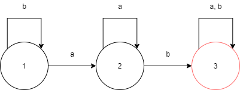

# Теория формальных языков и автоматов

## Установка:
```
1) Установить платформу node.js
2) Из папки tests выбрать интересующий и запустить node test.js
```

## Лабораторная 1
### Детерминированный конечный автомат
```
1. Создать объекты программы для представления детерминированного конечного автомата
(ДКА), его состояний и переходов.
2. Реализовать процедуры добавления/удаления переходов и состояний, добавления и
удаления начальных и заключительных состояний.
3. Реализовать процедуру перевода ДКА из заданного состояния в другое посредством одного
из допустимых переходов ДКА.
4. Реализовать процедуру/метод работы детерминированного конечного автомата по входной
цепочке символов алфавита ДКА.
```
### Реализация
```
Реализованные автоматы из книги Тома Стюарта Теория вычислений для программистов, страницы 90 - 91 
1) test1.js - детерминированный конечный автомат, детектирующий строки, которые содержат в себе подстроку 'ab'

```